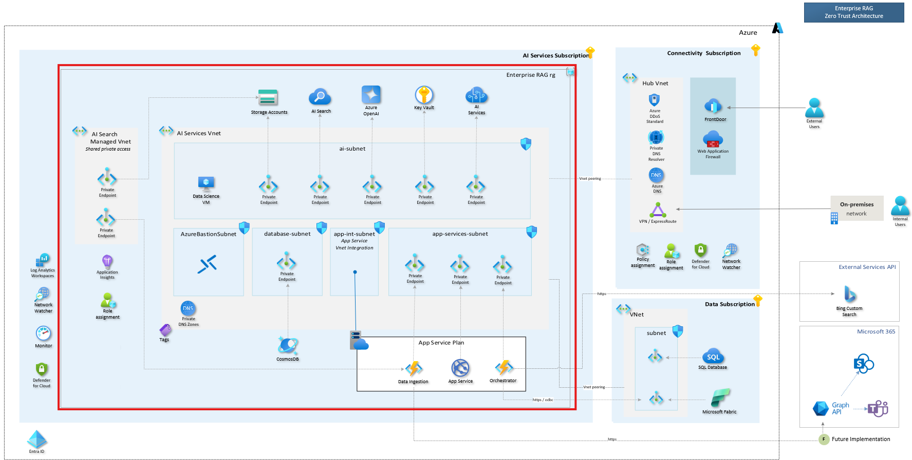
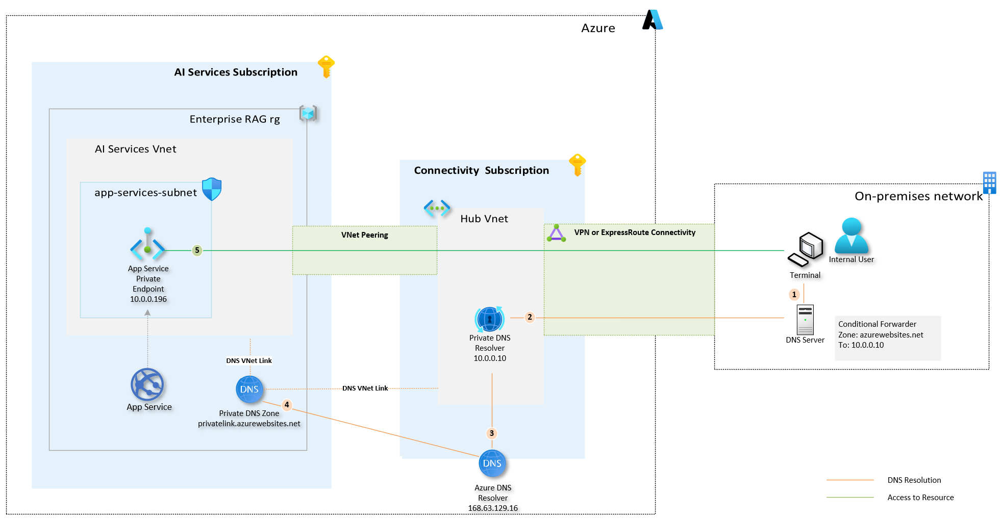
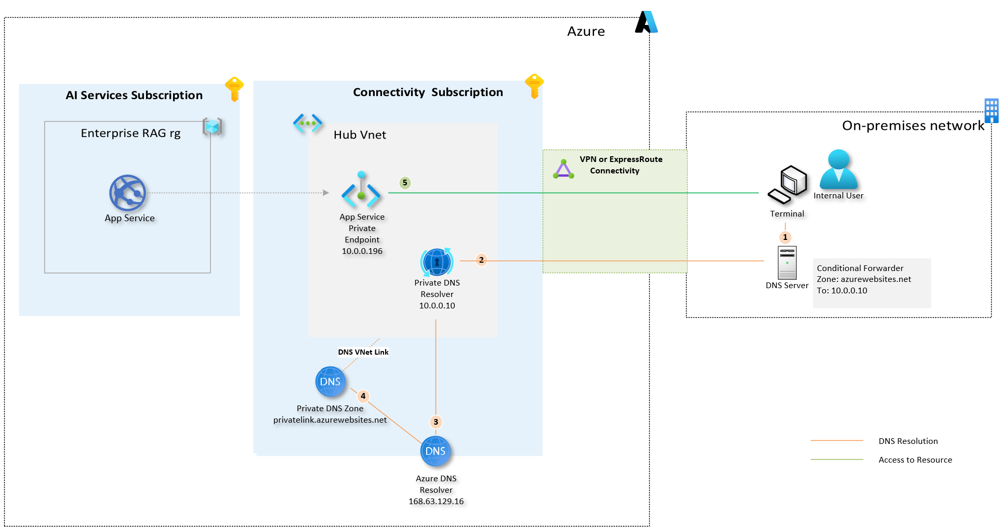
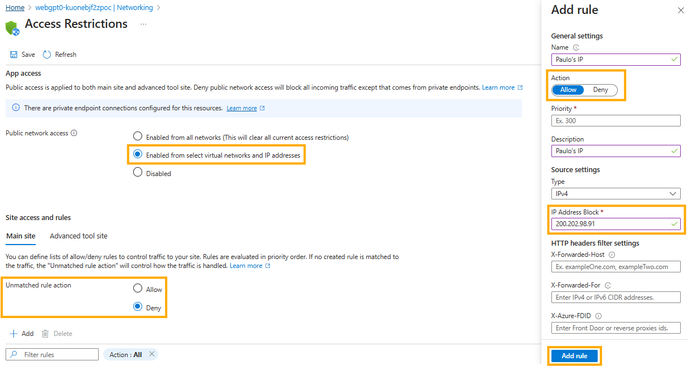
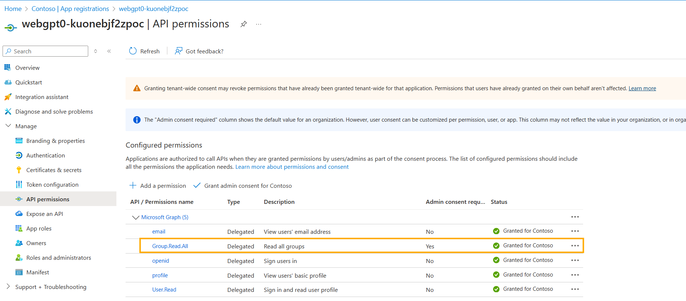
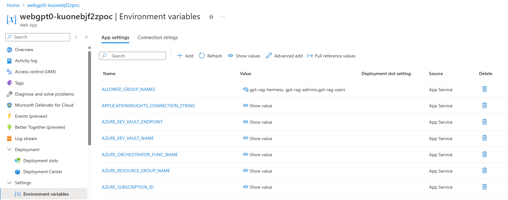
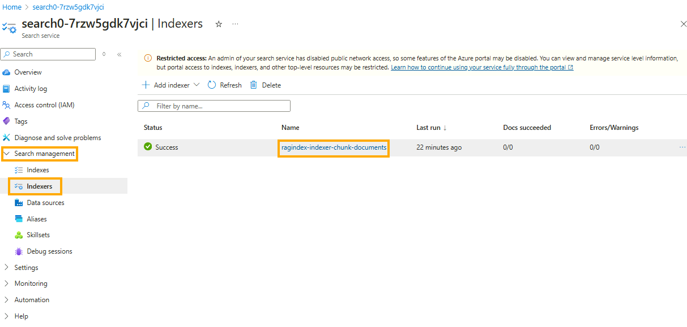
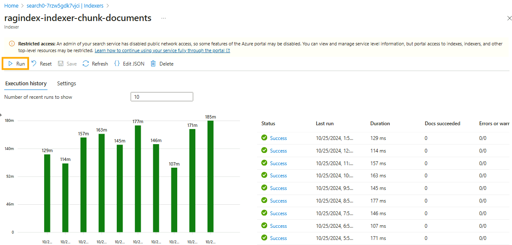

# GPT-RAG Solution Accelerator Administration Guide

*This guide provides administrators with comprehensive instructions on deploying, configuring, and managing the GPT-RAG Solution Accelerator using a Zero Trust Architecture.*

## Table of Contents

1. [**Introduction**](#introduction)
2. [**Solution Architecture**](#solution-architecture)
   - [2.1 Data Ingestion](#data-ingestion)
   - [2.2 Orchestration Flow](#orchestration-flow)
   - [2.3 Network Components](#network-components)
   - [2.4 Access Control](#access-control)
3. [**Admin Tasks**](#common-administrative-tasks-and-procedures)
   - [3.1 Deploying the Solution Accelerator](#deploying-the-solution-accelerator)
   - [3.2 Accessing the Data Science VM](#accessing-the-data-science-vm-via-bastion)
   - [3.3 Internal User Access](#internal-user-access)
     - [3.3.1 VNet Peering](#configuring-vnet-peering)
     - [3.3.2 Private Endpoints](#configuring-private-endpoints)
   - [3.4 External User Access](#external-user-access)
     - [3.4.1 Front Door & WAF](#configuring-front-door-and-web-application-firewall-waf)
     - [3.4.2 IP Allowlist](#configuring-ip-allowlist)
   - [3.5 Entra Authentication](#configuring-entra-authentication)
   - [3.6 Authorization Setup](#configuring-authorization)
   - [3.7 Setting Up Git Repos](#setting-up-git-repos)
4. [**User Guide**](#user-guide)
   - [4.1 App Access](#app-access)
   - [4.2 Upload Content](#upload-content)
   - [4.3 Reindexing Data](#reindexing-data)
5. [**Troubleshooting**](#troubleshooting)

---

## Introduction

The **GPT-RAG Solution Accelerator** enables organizations to leverage AI for enhanced customer support, decision-making, and data-driven processes by empowering systems to handle complex inquiries using extensive datasets. Designed to provide secure and efficient deployment, it allows businesses to integrate AI with existing operations, making it adaptable for both simple and advanced information retrieval.

Beyond classical RAG capabilities, the accelerator incorporates agents that support sophisticated scenarios such as NL2SQL query generation and other context-aware data interactions. This flexibility enables advanced use cases where AI can seamlessly retrieve and interpret information, meeting diverse technical requirements.

*GPT-RAG home page*

## Solution Architecture

The solution leverages a **Zero Trust Architecture** to ensure maximum security and compliance. All components are securely integrated within a virtual network, and communication between services is strictly controlled.

*Zero Trust Architecture*

The diagram above illustrates the Zero Trust architecture. The **GPT-RAG Solution Accelerator** scope encompasses components within the **Enterprise RAG** resource group, providing essential Zero Trust functionalities.

### Key Resources

- **Virtual Network (VNet):** Isolates resources and controls inbound and outbound traffic.
- **Azure App Service:** Hosts the front-end application.
- **Azure Functions:** Executes serverless functions for data ingestion and orchestration.
- **Azure Storage Account:** Stores data blobs for retrieval.
- **Azure AI Search:** Indexes and searches data efficiently.
- **Azure OpenAI:** Generates responses and vector embeddings.
- **Azure AI Services:** Reads documents for data Ingestion.
- **Azure CosmosDB:** Stores conversation history and metadata to improve quality.
- **Azure Key Vault:** Manages secrets used by the solution.
- **Azure Private Endpoints:** Secures network communication between services.
- **Data Science VM:** Provides a secure Bastion environment for admins and developers to configure the solution.

For more information about Zero Trust architecture, see the [Enterprise RAG (GPT-RAG) Architecture](ARCHITECTURE.md) page.

## Data Ingestion

Data ingestion is a crucial part of the solution, enabling the system to retrieve accurate and up-to-date information.

### How It Works

1. **Data Collection:** Documents are ingested from `documents` blob container in the GPT-RAG storage account.
2. **Data Preprocessing:** The documents are prepared for indexing in AI Search Index, including breaking them into smaller chunks and optimizing them for efficient searchability.
3. **Indexing for Search:** The chunks are then indexed within Azure AI Search, allowing for efficient and accurate retrieval during query processing.

> [!NOTE]  
> The data ingestion process is scheduled to run every hour. It uses a pull approach where an Azure AI Search indexer leverages a custom Web API skill, running as a Function App, to handle preprocessing and apply tailored chunking strategies specific to each document type before indexing.

For more information about the data ingestion process take a look at the [GPT-RAG ingestion](https://github.com/Azure/gpt-rag-ingestion) function app repo.

## Orchestration Flow

The solution uses an **Agentic Orchestration** approach, enabling agents to operate autonomously for efficient handling of user requests. The orchestration flow described below provides a typical structure but can be tailored to meet specific requirements.

### How It Works

1. **User Interaction:** The user submits a query through the front-end application.
2. **Orchestration Process:** The Orchestrator initiates a group chat with specialized agents to address the query.
   - Agents retrieve relevant data from an AI Search index or a SQL database.
   - The GPT model generates a response based on the collected information.
3. **Response Delivery:** The front-end application returns a grounded answer to the user.

> [!NOTE]  
> The orchestrator runs as a Function App, ensuring scalable and efficient agent orchestration.

For more information about the agentic orchestration take a look at the [GPT-RAG orchestration](https://github.com/Azure/gpt-rag-agentic) function app repo.

## Network Components

The networking architecture for the GPT-RAG solution leverages Azure’s advanced features to ensure a secure, flexible, and isolated environment, adhering to Zero Trust principles through the use of private endpoints and stringent access controls.

1. **Azure Virtual Network (VNet):** Provides a logically isolated network environment, segmented into subnets for different application tiers, ensuring organized and secure deployment of resources.
    
2. **Azure Private Link and Private Endpoints:** Establish secure, private connections to Azure services, keeping traffic within the Microsoft backbone network and minimizing exposure to the public internet.
    
3. **Private DNS Zones:** Enable internal name resolution within the Virtual Network, ensuring secure communication between services without public exposure.
    
4. **Network Security Groups (NSGs):** Control and restrict inbound and outbound traffic to Azure resources with granular security rules, enhancing the protection of your network.
    
5. **Azure Bastion:** Provides secure access for the development team to the VM used for GPT-RAG deployment via the Azure portal, without exposing it to the internet, ensuring secure and controlled deployment activities.

> [!NOTE]  
> The Infrastructure as Code (IaC) templates provided in this solution accelerator enable automated, customizable provisioning of networking resources, ensuring alignment with your organization's naming conventions and address range standards. Alternatively, you may also opt to provision these resources manually if preferred.

> [!NOTE]  
> **DNS Configuration Options:** This solution accelerator configures Azure Private DNS Zones to enable seamless resolution of private endpoints within the resource group. If your organization requires customized DNS settings, you have the option to manage private DNS zones independently, integrate with on-premises DNS servers, or configure conditional forwarders as needed. For more details, refer to [Private Endpoint DNS Integration scenarios](https://github.com/dmauser/PrivateLink/tree/master/DNS-Integration-Scenarios).

To enable access to the solution accelerator, **external users** can connect through **Azure Front Door** with a **Web Application Firewall (WAF)**, ensuring secure and managed traffic. For **internal users**, access can be configured through **VNet Peering** with secure connectivity via **VPN** or **ExpressRoute**.

Alternatively, internal users may connect using additional **Private Endpoints** for both the web application and storage account within an accessible Virtual Network. Further details on configuring these options will be provided later in the document.

<!-- *Refer to the Solution Architecture diagram for a visual representation.* -->

## Access Control

### Authentication

The solution utilizes **Azure Entra ID** (formerly Azure Active Directory) for authenticating users accessing the front-end application. This ensures secure access control and integration with organizational identity management.

### Authorization

Authorization is managed by defining specific Entra ID users and groups that are permitted to use the application. These allowed users and groups are configured directly in the App Service settings, ensuring that only authorized individuals have access to the application.

# Common Administrative Tasks and Procedures

This section provides step-by-step guides for essential tasks.

## Deploying the Solution Accelerator

Deploy the GPT-RAG Solution Accelerator within a Zero Trust Architecture.

This setup guide will walk you through provisioning a resource group containing all the essential components for the solution to operate effectively. 

The diagram below highlights the resource group and its corresponding components, marked in red, that will be provisioned during the process.

### Prerequisites

- Azure subscription with access to **Azure OpenAI**.
- **Owner** or **Contributor + User Access Administrator** permission at the Subscription scope.
- Confirm you have the required quota to provision resources in the chosen Azure region for deployment. For details on resources and SKUs, refer to the [Installation Guide](https://github.com/Azure/GPT-RAG/blob/main/docs/AUTOMATED_INSTALLATION.md#resource-list).
- Agree to the Responsible AI terms by initiating the creation of an [Azure AI service](https://portal.azure.com/#create/Microsoft.CognitiveServicesAllInOne) resource in the portal. \*\*

> [!NOTE]
> \*\* This step is unnecessary if an Azure AI service resource already exists in the subscription. 

### Deployment Overview

  1. Clone the deployment repository.
  2. Update the configuration files to reflect your desired settings.
  3. Execute the automated deployment script.

For the detailed, step-by-step deployment procedure, refer to the [installation procedure](AUTOMATED_INSTALLATION.md).

### Validation

- Ensure all resources are deployed successfully.
- Verify that access controls and network configurations align with Zero Trust principles.

> [!NOTE]  
> After the initial deployment, you may choose to customize or update features such as prompts, add a logo to the frontend, or try a different chunking approach. For optional customization, refer to the deployment section in each component’s repository for guidance.

## Accessing the Data Science VM via Bastion

After deploying the Solution Accelerator, administrators and dev teams may need to access a Test Virtual Machine (VM) for configuration, customization, or deployment tasks. This section outlines the procedure for connecting to the Data Science VM using Azure Bastion.

> [!NOTE]
> If these users already have secure access to the VNet through ExpressRoute or VPN, they can perform the required tasks directly from their own machines, removing the need for a Bastion VM and making its creation optional.

### **Prerequisites**

- **Azure Permissions:**
  - **Virtual Machine Contributor** role or higher on the resource group containing the Bastion and VM.
  
- **Access Credentials:**
  - Access to the Azure Key Vault containing the Bastion credentials.
  
### **Procedure**

Follow these steps to securely connect to the Data Science VM through Azure Bastion:

#### **Step 1: Access the Azure Portal**

#### **Step 2: Locate the Virtual Machine Resource**

1. **Go to the Bastion blade:**
   
   - In the Azure Bastion overview page, log into the created VM with the user **gptrag** and authenticate with the password stored in the key vault, similar to the figure below:  

   
   *Bastion Connection Interface*

> [!NOTE]
> The Data Science VM accessed through Bastion is intended solely for administrators and configuration personnel and is not meant for end-users. It is designed for individuals responsible for configuring, customizing, or updating the solution.

## Internal User Access

Provide user access to internal users via secure network configurations.

### Configuring VNET Peering

Establish VNET Peering to enable secure and efficient communication between virtual networks for users within a private network connected via ExpressRoute or VPN. This configuration ensures that internal users can seamlessly access the application's frontend and storage services.

#### **Pre-requisites**

- **Azure Permissions:**
  - **Network Contributor** role or higher on both virtual networks involved in the peering.

- **Network Configuration:**
  - Ensure that the virtual networks do not have overlapping IP address spaces.
  - Both virtual networks must reside within the same Azure region or supported regions for peering.

#### **Procedure**

For step-by-step configuration instructions, refer to the [Create a VNET Peering Procedure](https://learn.microsoft.com/en-us/azure/virtual-network/virtual-network-manage-peering?tabs=peering-portal).

### Configuring Private Endpoints

Implement Private Endpoints for **App Service** and **Storage Accounts** to provide secure and streamlined access for users connected through ExpressRoute or VPN. This approach offers an alternative to VNET Peering by allowing private connectivity to specific services without exposing them to the public internet.

#### **Pre-requisites**

- **Azure Permissions:**
  - **Network Contributor** or **Private Endpoint Contributor** role on the virtual network where the private endpoint will be deployed.
  - **Contributor** role or higher on the App Service and Storage Account resources.

- **Network Configuration:**
  - Ensure DNS settings are configured to resolve the private endpoints correctly.
  - Verify that the virtual network has sufficient IP address space to accommodate the private endpoints.

#### **Procedure**
  
For detailed configuration guidance for App Service, see the [Connect privately to an App Service apps using private endpoint](https://learn.microsoft.com/en-us/azure/app-service/overview-private-endpoint). The steps for creating a private endpoint for a Storage Account are similar to those for App Service.

## External User Access

Provide user access to external users via secure network configurations.

### Configuring Front Door and Web Application Firewall (WAF)

Configure **Azure Front Door** in conjunction with a **Web Application Firewall (WAF)** to manage external user access. This setup provides global load balancing, ensures high availability, and protects the application from common web threats and vulnerabilities.

<!--  -->

#### **Pre-requisites**

- **Azure Permissions:**
  - **Contributor** role or higher on the Azure subscription or the specific resource group where Front Door and WAF will be deployed, in general deployed in a **Connectivity Subscription**.

- **Configuration Requirements:**
  - Custom domain ownership if you plan to use custom domains with Front Door.
  - SSL certificates for securing HTTPS traffic, if applicable.

#### Procedure

To set up Front Door and WAF, follow the instructions in the [Create an Azure Front Door using Azure portal](https://learn.microsoft.com/en-us/azure/frontdoor/create-front-door-portal) page.

#### **Alternative Deployment Option**

> [!NOTE]
> Alternatively, Front Door and WAF can be deployed within the same Subscription and resource group as GPT-RAG to streamline the configuration process.

### Configuring IP Allowlist

With the **Private Endpoint** already set up for **App Service**, you can still configure an IP allowlist for specific cases, such as temporary access to the frontend for quick testing. This setup ensures that only trusted sources with pre-approved IPs can access the service publicly when necessary.

> [!IMPORTANT]  
> Use this approach for short-term access, such as quick testing or setup for a small group of users. It’s a simple control but relies on a public endpoint, so apply it only when necessary for specific cases.

#### **Pre-requisites**

- **Azure Permissions:**
  - **Contributor** role or higher on the Azure subscription or the specific resource group containing the App Service.

- **Network Configuration:**
  - A list of trusted IP addresses or ranges that will be allowed access to the public endpoints.

#### **Procedure**

1. **Access the Azure Portal:**
   - Sign in to the [Azure Portal](https://portal.azure.com).

2. **Restrict Access to App Services:**
   - Navigate to **App Services** and select the target App Service.
   - Go to **Networking** and configure **Access Restrictions** by adding rules to allow specific IP addresses with assigned priorities.
   - Save the changes to enforce the restrictions.

*Configuring IP Allowlist for Public Endpoints*

#### Validation

- Test access to the App Service and Storage Account from both permitted and non-permitted IP addresses.
- Monitor access logs regularly to ensure only authorized IPs have access.

## Configuring Entra Authentication

This section outlines the steps to configure Azure Entra authentication for Front-end app service.

#### Prerequisites

- The front-end app deployed in App Service.
- Permission to register your application in Entra ID.*

*\* Use one of these Entra roles: **Application Administrator**, **Cloud Application Administrator**, or **Global Administrator**.*

#### Procedure

If you **have the necessary permissions** to register a new application in Azure Entra ID, simply follow step 3 of the procedure outlined on this page: [Add app authentication](https://learn.microsoft.com/en-us/azure/app-service/scenario-secure-app-authentication-app-service?tabs=workforce-configuration#3-configure-authentication-and-authorization) or [watch this brief tutorial](https://youtu.be/sA-an25jMB4) for step-by-step instructions.

If you **do not have permission** to register a new application in Azure Entra ID, that’s not a problem. You can still set up authentication by collaborating with an Entra ID administrator. Simply follow the procedure described on this page: [How to Apply Easy Auth on Web App under a High-security policy environment](https://learn.microsoft.com/en-us/azure/app-service/scenario-secure-app-authentication-app-service?tabs=workforce-configuration#3-configure-authentication-and-authorization).

#### Validation

- Access your web app URL.
- You should be redirected to the Azure AD sign-in page.
- Upon successful login, you should be redirected back to your app.

## Configuring Authorization

Control user access within front-end application using **user principal IDs**, **usernames**, or **groups**.

#### Prerequisites

- **Configured Authentication**: Ensure that Entra ID authentication is properly set up in your app service.
- **List of Authorized Entities**: Compile lists of authorized user principal IDs, usernames and/or group names.
- **Delegated Microsoft Graph Permissions** *(To define allowed groups)*: Permission to consent your application the **Microsoft Graph `Group.Read.All`** permission in Entra ID.

*\* Use one of these Entra roles: **Application Administrator**, **Cloud Application Administrator**, or **Global Administrator**.*

#### Procedure

1. **Identify Authorized Users and Groups**

   - **User Principal IDs**: Unique identifiers for users (e.g., `user-principal-id-1`).
   - **Usernames**: Typically the user's email address (e.g., `user1@example.com`).
   - **Group Names** *(Optional)*: Entra ID group names.

2. **Configure Microsoft Graph Permissions (If you are allowing Access to Groups)**

   If you plan to use group-based authorization:

   - **Navigate to API Permissions**:

     - In the registered application, go to **API permissions**.

   - **Add `Group.Read.All` Permission**:

     - Click **Add a permission** > **Microsoft Graph** > **Application permissions**.
     - Search for and select **`Group.Read.All`**.
     - Click **Add permissions**.

   - **Grant Admin Consent**:

     - Click on **Grant admin consent for [Your Tenant Name]**.
     - Confirm the action.

   
   *Example of consenting Microsoft Graph permission*     

3. **Set Environment Variables**

   In your application's settings, populate the environment variables needed to define which users or groups can access the application. You don’t need to create all three—just the ones relevant to your authorization setup:

   - Use `AUTHORIZED_USER_PRINCIPALS` if you want to specify user principal IDs (e.g., `user-principal-id-1`).
   - Use `AUTHORIZED_USER_NAMES` if you want to specify usernames (e.g., `user1@example.com,user2@example.com`).
   - Use `AUTHORIZED_GROUP_NAMES` if you want to specify group names.

   
   *Example of configuring allowed groups*

4. **Restart the Application**

   After making changes to environment variables and permissions, restart your application to apply the updates.

#### Validation

Depending on your authorization setup—**user principal IDs**, **usernames**, or **group names**—validate access as follows:

- **By User Principal ID**:
  - **Log In** with a user whose ID is in `AUTHORIZED_USER_PRINCIPALS`.
  - **Verify** access to protected areas.

- **By Username**:
  - **Log In** with a username listed in `AUTHORIZED_USER_NAMES`.
  - **Confirm** access is granted.

- **By Group Membership**:
  - **Log In** with a user belonging to a group in `AUTHORIZED_GROUP_NAMES`.
  - **Ensure** access to secured sections.

**Note**: Use and test only the methods you have configured to ensure access controls are functioning correctly.

## User Guide

This section guides users through essential tasks required to interact with the GPT-RAG Solution Accelerator. This section is divided into three main parts:

1. **Accessing the Application Front End**
2. **Managing Document Uploads**
3. **Reindexing Documents in AI Search**

### Accessing the Application Front End

To connect to the web frontend of the GPT-RAG Solution Accelerator:

- **Navigate to the Web Application Endpoint:**
  - Open your preferred web browser.
  - Enter the web application endpoint URL provided by your administrator. The endpoint will follow a format similar to `webgpt0-[random_suffix].azurewebsites.net`, where `[random_suffix]` is a unique identifier assigned during deployment.
  - **Example:** `https://webgpt0-abc123.azurewebsites.net`
  - Log in using your authorized credentials to access the application's interface.

*GPT-RAG Front-end UI*

### Uploading Documents for Ingestion

*This task updates documents to be indexed and is intended for users responsible for performing these updates. Users who are not involved in updating documents do not need to handle this task.*

#### **Prerequisites**

Before uploading documents, ensure that you have the necessary permissions in Azure:

- **Azure Role Required:** You must have the **Storage Blob Data Contributor** role assigned in Azure Entra ID for the storage account you will be accessing. This role allows you to upload and manage blobs within the storage containers.

  > **Note:** If you do not have the required role, contact your Azure administrator to obtain the necessary permissions.

#### **Step 1: Access the Correct Storage Account**

1. **Log in to the Azure Portal:**
   - Navigate to [Azure Portal](https://portal.azure.com/) and sign in with your Azure credentials.

2. **Locate the Storage Account:**
   - In the Azure Portal, go to the **Storage Accounts** section.

   
   *Selecting documents storage account*

   - **Important:** Ensure you select the **storage account name** provided by your administrator.

   
   *Selecting documents storage account*

   > [!TIP]
   > It is the storage account **without** the suffixes **"ing"** or **"orc"**.

#### **Step 2: Upload Documents via Azure Portal**

1. **Navigate to the Documents Container:**
   - Within the selected storage account, click on **Containers** in the left-hand menu.
   - Locate and select the **Documents** container from the list.

2. **Upload Your Files:**
   - Click the **Upload** button at the top of the container view.
   - In the upload pane, click **Browse** to select the files you wish to upload from your local machine.
   - After selecting the files, click **Upload** to begin the process.
   - Wait for the upload to complete. Once finished, your documents will be available in the **Documents** container for ingestion.

   
   *Sample document upload screen - Azure Portal*

   > **Automatic Indexing:** The AI Search indexer automatically checks for new documents every hour, ensuring that uploaded documents are indexed without manual intervention. If you prefer to index documents immediately, refer to the **Reindexing Content in AI Search** section.

#### **Alternative Method: Using Azure Storage Explorer**

For a more streamlined experience, you can use **Azure Storage Explorer**, a free tool that provides a graphical interface for managing your Azure storage resources.

1. **Download and Install Azure Storage Explorer:**
   - Download the correct version for your OS from the [Azure Storage Explorer Download Page](https://azure.microsoft.com/en-us/products/storage/storage-explorer/#Download-4).
   - Follow the installation instructions to set up the application on your computer.

2. **Connect to Your Azure Account:**
   - Launch **Azure Storage Explorer**.
   - Click on **Add an Account** and sign in with your Azure credentials to access your storage resources.

3. **Access the Documents Container:**
   - In the left-hand pane, expand your subscription to view available storage accounts.
   - Select the storage account **without** the suffixes **"ing"** or **"orc"**.
   - Navigate to the **Containers** section and open the **Documents** container.

   <!-- 
   *Sample document upload screen - Azure Storage Explorer* -->

4. **Upload Your Files:**
   - Right-click on the **Documents** container and select **Upload** > **Upload Files**.
   - Browse and select the files you wish to upload from your local machine.
   - Click **Upload** to start the process.
   - Monitor the upload progress in the dialog box. Once completed, your documents will be available in the **Documents** container for ingestion.

### Reindexing Documents in AI Search

*This task updates the retrieval index to ensure that search results remain accurate and efficient. It is designated for users responsible for indexing operations. Users who are not handling the retrieval index do not need to perform this task.*

#### **Prerequisites**

Before reindexing, ensure that you have the necessary permissions:

- **Azure Role Required:** You must have the **Cognitive Search Contributor** or **Cognitive Search Index Administrator** role assigned in Azure Entra ID for the AI Search resource.

  > **Note:** If you do not have the required role, contact your Azure administrator to obtain the necessary permissions.

#### **Step 1: Access AI Search Resource**

1. **Log in to the Azure Portal:**
   - Navigate to [Azure Portal](https://portal.azure.com/) and sign in with your Azure credentials.

2. **Navigate to AI Search:**
   - In the Azure Portal, go to the **Resource Groups** section.
   - Select the resource group associated with your application.
   - Within the resource group, locate and select the **AI Search** resource.

#### **Step 2: Reindex the Content**

1. **Open Search Management:**
   - In the AI Search resource overview, click on **Search Management** in the left-hand menu.

   
   *AI Indexer in Search Management*

2. **Access Indexers:**
   - Click on **Indexers** to view the list of available indexers.
   - Locate and select the **ragindex-indexer-chunk-documents**.

3. **Run the Search Index:**
   - Click the **Run** button to initiate the reindexing process for **ragindex-indexer-chunk-documents** indxer.

   
   *AI Search Reindexing UI*

   > **Note:** If you wish to reindex all content, click **Reset** before running the search index.

## Setting Up Git Repos

The GPT-RAG Solution Accelerator comprises four Git repositories, each housing the code for specific application components. Whether you're using GitHub, Azure Repos in Azure DevOps, or another Git service, this section outlines the organization of the codebase and provides instructions for integrating it into your own Git repositories. You can incorporate the Solution Accelerator's code into your Git repositories either by using the repositories as templates or by forking and then creating pull requests in case you want to contribute to the Open Source project.

### Codebase Organization

The Solution Accelerator is structured across four primary Git repositories:

1. **gpt-rag**: The main repository containing Infrastructure as Code (IaC) Bicep templates and comprehensive documentation for the Solution Accelerator.
2. **gpt-rag-ingestion**: Manages the Data Ingestion component, optimizing data chunking and indexing for the Retrieval-Augmented Generation (RAG) retrieval step.
3. **gpt-rag-agentic**: Serves as the orchestrator, coordinating the flow to retrieve information and generate user responses using Agentic and AutoGen agents.
4. **gpt-rag-frontend**: Provides the front-end application, delivering a scalable and efficient web interface for the Solution Accelerator.

### Option 1: Using Repositories as Templates (Most Common)

If you'd like to use the repositories as a starting point without making updates to the original, you can use GitHub's template feature. This will create an independent copy of the repository, which you can fully customize. However, keep in mind that this option won’t automatically sync with future updates from the original repository.

> **Note:** The following steps should be performed for each of the four Solution Accelerator repositories: **gpt-rag**, **gpt-rag-ingestion**, **gpt-rag-agentic**, and **gpt-rag-frontend**.

#### Option 1.1: Setting Up GitHub Repositories

In this case we will use GitHub's template feature to create a copy of the repository.

**Prerequisites**

  - **Read Access** to the template repositories.
  - **Create Repository** permission in your account or organization.

**Procedure**

1. **Navigate to the Repository:**
   - Visit the GitHub page of the repository you wish to use as a template (e.g., [gpt-rag-agentic](https://github.com/Azure/gpt-rag-agentic)).

2. **Use as Template:**
   - Click the **Use this template** button located above the repository files.
   - In the dialog that appears, enter your new repository name, select the owner (your account or organization), and choose the visibility (public or private).

3. **Create Repository:**
   - Click **Create repository from template**. GitHub will generate a new repository in your account with the contents of the template repository.

#### Option 1.2: Importing Repositories into Azure Repos (Azure DevOps)

**Prerequisites**

   - **Access to Azure DevOps Organization and Project.**
   - **Repository Creation Rights** within the target project.

**Procedure**

1. **Prepare Azure DevOps Project:**
   - Ensure you have an Azure DevOps organization with the necessary permissions, typically as a Project Administrator or with explicit repository creation rights.

2. **Access Azure Repos:**
   - Navigate to your Azure DevOps project.
   - Go to **Repos** > **Files**.

3. **Import Repository:**
   - Click the **Import a repository** button.
   - In the import dialog, enter the **Clone URL** of the GitHub repository you wish to import (e.g., `https://github.com/Azure/gpt-rag-agentic.git`).

4. **Authentication for Private Repositories:**
   - If importing a private repository, provide the necessary credentials, such as a Personal Access Token (PAT), to authorize the import.

5. **Start Import:**
   - Click **Import** to begin the process. Azure DevOps will clone the repository into your Azure Repos.

6. **Verify Import:**
   - Once the import is complete, verify that the repository and its branches have been correctly imported by browsing the files in Azure Repos.

**Reference:**
For detailed instructions and advanced import scenarios, refer to the [Importing a GitHub repository into Azure DevOps](https://learn.microsoft.com/en-us/azure/devops/repos/git/import-git-repository) documentation.

#### Option 1.3: Using a different Git service

**Procedure**

1. **Create a New Repository:**
   - Set up a new repository on your preferred Git service (e.g., GitLab, Bitbucket).

2. **Download and Extract:**
   - Download the repository as a ZIP file from GitHub, extract the contents to your local machine.

3. **Add to Your Git Repository:**
   - Initialize your local repository, add the extracted files, commit, and push them to your Git service.

4. **Customize:**
   - Modify the code as per your requirements and push updates to your repository.

### Option 2: Contributing by Forking and Creating Pull Requests

If you intend to contribute to the ongoing development of the Solution Accelerator by submitting pull requests, please refer to our [Contribution Guidelines](https://github.com/Azure/GPT-RAG/blob/main/CONTRIBUTING.md#contribution-guidelines) for detailed instructions on how to fork repositories and create pull requests.

## Troubleshooting

Refer to the [Troubleshooting Guide](TROUBLESHOOTING.md) for common issues and resolutions related to the GPT-RAG Solution Accelerator.
