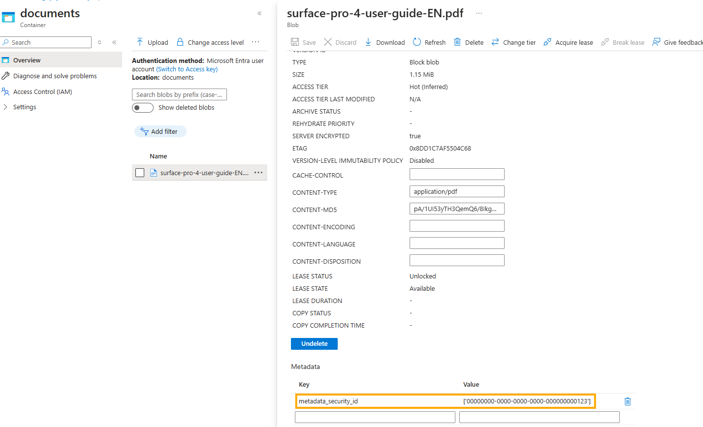

# Filter Files with AI Search Using Security Trimming

This customization allows the GPT-RAG solution to filter information during searches in AI Search based on a specific field defined in the index schema. The AI Search setup automatically creates an index with a `metadata_security_id` field. This field is mapped in the skillset for use during indexing, enabling secure, targeted searches.

## General Instructions

In the following sections, we will provide detailed instructions on how to configure and use this functionality.

**Pre-requisites**:

- **Storage Metadata**: Ensure that the files in the storage container to be indexed include a `metadata_security_id` field in their metadata. This field should contain a list of values, which may include:
  - Entra ID `object_ids` of authorized users.
  - Entra ID group names.

By default, the feature is activated and always returns documents where the `metadata_security_id` field is blank, ensuring broad accessibility when no specific restrictions are defined.

**General Instruction Steps**:

1. **Deploy the Solution**:
   Deploy the GPT-RAG solution. The Function Apps for Ingestion and Orchestration will be set up to handle security trimming by default. This ensures that the AI Search index includes the `metadata_security_id` field and that the skillset is correctly mapped.

2. **Verify Metadata**:
   Ensure that all files in the storage container have the `metadata_security_id` metadata field populated with the relevant values, such as Entra ID `object_ids` or group names. This step is crucial for restricting document access to authorized users only.

3. **Check Deployment**:
   After deployment, verify that the AI Search index has been created with the `metadata_security_id` field and that the skillset mappings are functioning correctly.

* [Azure AI Search - Search Trimming Documentation](https://learn.microsoft.com/en-us/azure/search/search-security-trimming-for-azure-search)