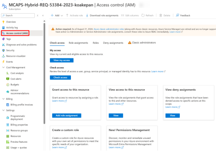
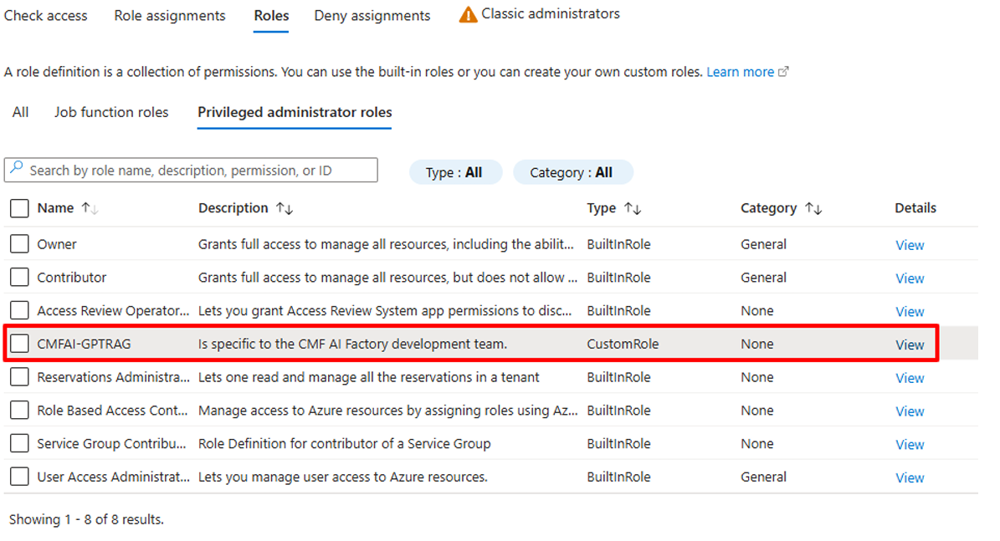
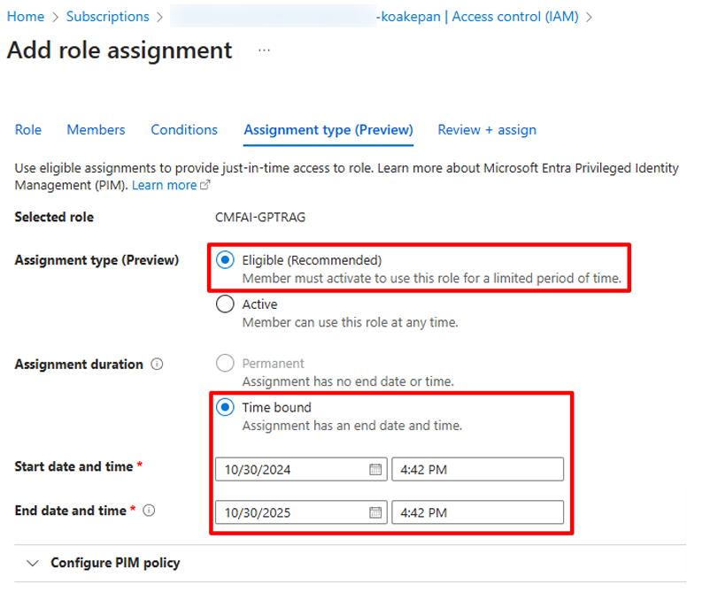

# Creating a Custom Role for GPT-RAG Installation

This guide provides steps to create a custom role in Azure and assign it to a user for performing the GPT-RAG installation at the subscription level.

> **Tip**  
> This procedure applies when you prefer creating a custom role with more specific permissions instead of assigning the **Owner** or **Contributor + User Access Administrator** role.

## Step-by-Step Procedure

1. **Go to Subscriptions**
   - In the Azure portal, navigate to **Subscriptions**.
   - Select the relevant subscription where the custom role will be assigned.

2. **Access Control (IAM)**
   - Within the selected subscription, click on **Access control (IAM)** in the left-hand menu.

   

3. **Create a Custom Role**
   - Click **+ Add** and then **Add custom role**.
   - Choose **Start from scratch** to create a new role with custom permissions.

   

4. **Configure Role Details**
   - In the **Custom role name** field, enter a unique name for the role (e.g., `CMFAI-GPTRAG`).
   - In the **Description** field, provide a description for the role's purpose, such as "Custom role for GPT-RAG installation."

   

5. **Define Permissions**
   - Go to the **JSON** tab.
   - Add the following actions and notActions.

```json
{
  "actions": [
    "*",
    "Microsoft.Authorization/roleAssignments/write",
    "Microsoft.Resources/deployments/read",
    "Microsoft.Resources/deployments/write",
    "Microsoft.Resources/deployments/delete",
    "Microsoft.Resources/deployments/cancel/action",
    "Microsoft.Resources/deployments/validate/action",
    "Microsoft.Resources/deployments/whatIf/action",
    "Microsoft.Resources/deployments/exportTemplate/action"
  ],
  "notActions": [
    "Microsoft.Authorization/*/Delete",
    "Microsoft.Authorization/elevateAccess/Action",
    "Microsoft.Blueprint/blueprintAssignments/write",
    "Microsoft.Blueprint/blueprintAssignments/delete",
    "Microsoft.Compute/galleries/share/action",
    "Microsoft.Purview/consents/write",
    "Microsoft.Purview/consents/delete",
    "Microsoft.Authorization/classicAdministrators/write",
    "Microsoft.Authorization/classicAdministrators/delete",
    "Microsoft.Authorization/denyAssignments/write",
    "Microsoft.Authorization/denyAssignments/delete",
    "Microsoft.Authorization/diagnosticSettings/write",
    "Microsoft.Authorization/diagnosticSettings/delete",
    "Microsoft.Authorization/locks/write",
    "Microsoft.Authorization/locks/delete",
    "Microsoft.Authorization/policyAssignments/delete",
    "Microsoft.Authorization/policyAssignments/write",
    "Microsoft.Authorization/policyAssignments/exempt/action",
    "Microsoft.Authorization/policyAssignments/privateLinkAssociations/write",
    "Microsoft.Authorization/policyAssignments/privateLinkAssociations/delete",
    "Microsoft.Authorization/policyAssignments/resourceManagementPrivateLinks/write",
    "Microsoft.Authorization/policyAssignments/resourceManagementPrivateLinks/delete",
    "Microsoft.Authorization/policyAssignments/resourceManagementPrivateLinks/privateEndpointConnections/write",
    "Microsoft.Authorization/policyAssignments/resourceManagementPrivateLinks/privateEndpointConnections/delete",
    "Microsoft.Authorization/policyAssignments/resourceManagementPrivateLinks/privateEndpointConnectionProxies/write",
    "Microsoft.Authorization/policyAssignments/resourceManagementPrivateLinks/privateEndpointConnectionProxies/delete",
    "Microsoft.Authorization/policyAssignments/resourceManagementPrivateLinks/privateEndpointConnectionProxies/validate/action",
    "Microsoft.Authorization/policyDefinitions/write",
    "Microsoft.Authorization/policyDefinitions/delete",
    "Microsoft.Authorization/policyExemptions/write",
    "Microsoft.Authorization/policyExemptions/delete",
    "Microsoft.Authorization/policySetDefinitions/write",
    "Microsoft.Authorization/policySetDefinitions/delete",
    "Microsoft.Authorization/roleAssignments/delete",
    "Microsoft.Authorization/roleAssignmentScheduleRequests/write",
    "Microsoft.Authorization/roleAssignmentScheduleRequests/cancel/action",
    "Microsoft.Authorization/roleDefinitions/write",
    "Microsoft.Authorization/roleDefinitions/delete",
    "Microsoft.Authorization/roleEligibilityScheduleRequests/write",
    "Microsoft.Authorization/roleEligibilityScheduleRequests/cancel/action",
    "Microsoft.Authorization/roleManagementPolicies/write"
  ]
}
```

6. **Review and Create**
   - Go to the **Review + create** tab.
   - Review all role settings, and once confirmed, click **Create**.
   - The new custom role may take a few minutes to appear in the role list.

   

7. **Assign the Custom Role to a User**
   - Return to **Access control (IAM)** and select **+ Add** > **Add role assignment**.
   - Choose the custom role created (e.g., `CMFAI-GPTRAG`) under **Role**.
   - Under **Members**, select **+ Select members**, then choose **User, group, or service principal**, and select the user to assign this role to.

   

   - Under **Conditions** > **What User can do**, select **Allow user to assign all roles**.

   

   - On the **Assignment type** tab, select the **Assignment type**:
     - **Eligible** – Requires the user to perform one or more actions to activate the role, such as multifactor authentication, providing a business justification, or requesting approval. **Note:** Applications, service principals, and managed identities cannot perform activation steps.
   - For **Assignment duration**, select **Time bound** if needed, and specify start and end dates.

8. **Finalize the Assignment**
   - On the **Assignment type** tab, select **Eligible** (recommended) or **Active** depending on access requirements.
   - Set the **Assignment duration** to either **Permanent** or **Time bound** as needed.
   - Click **Review + assign** to complete the process.

   

## Conclusion

Your custom role is now created and assigned, enabling the user to carry out the GPT-RAG installation.

---

### Authors

- Kyle Akepanidtaworn, AI Specialized CSU, Global Customer Success, Microsoft, koakepan@microsoft.com
- Aparna Wani, Solution Architect, LTI Mindtree, v-aparnawani@microsoft.com
- Raghav Agrawal (International Supplier), LTI Mindtree, v-ragagrawal@microsoft.com
- Varun Balakrishnan Nambiar (International Supplier), Solution Architect, LTI Mindtree, v-vnambiar@microsoft.com